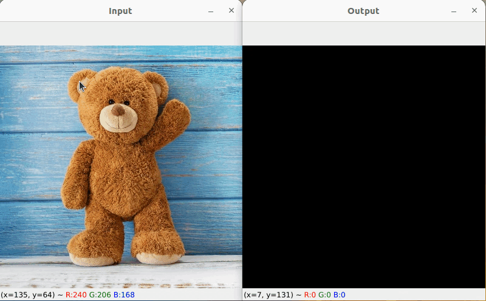

<!-- # Paint-Anything -->

We plan to create a very interesting demo by combining [Segment Anything](https://github.com/facebookresearch/segment-anything) and a series of stroke-based painting models, which makes more human-like painting process! We will continue to improve it and create more interesting demos. **Interesting ideas, results, and contributions are warmly welcome!**

## Demo
- Like human, Paint-Anything creates arts by firstly drawing the background roughly and then drawing the foreground with fine-grained strokes.

  

## Installation
```shell
python -m pip install torch torchvision torchaudio
python -m pip install -e segment_anything
python -m pip install -r lama/requirements.txt 
```

- The code is tested on the environment with Ubuntu 22.04, python 3.9.16, torch 1.10.1, cuda 11.3, opencv-python 4.7.0, and a 3090 GPU.

## Get Started

* Clone this repo:

  ```shell
  git clone https://github.com/Huage001/Paint-Anything.git
  cd Paint-Anything
  ```

* Download the model checkpoint of Segment Anything and move it to this project:

  ```shell
  wget https://dl.fbaipublicfiles.com/segment_anything/sam_vit_h_4b8939.pth
  mv sam_vit_h_4b8939.pth segment-anything/
  ```

* Download the model checkpoint of Lama and move it to this project:

  ```shell
  curl -L $(yadisk-direct https://disk.yandex.ru/d/ouP6l8VJ0HpMZg) -o big-lama.zip
  mv big-lama.zip lama/
  unzip lama/big-lama.zip
  rm lama/big-lama.zip
  ```

* Download the model checkpoint of LearningToPaint: [renderer.pkl](https://drive.google.com/open?id=1-7dVdjCIZIxh8hHJnGTK-RA1-jL1tor4) and [actor.pkl](https://drive.google.com/open?id=1a3vpKgjCVXHON4P7wodqhCgCMPgg1KeR), and move them to this project:

  ```shell
  mv [DOWNLOAD_PATH]/renderer.pkl painter/
  mv [DOWNLOAD_PATH]/actor.pkl painter/
  ```

* Run the following command:

  ```shell
  python paint_anything.py --img_path input/demo_input.jpg
  ```

  Follow the instruction printed on the console to run the interactive demo.

* Full usage:

  ```shell
  python paint_anything.py [-h] --img_path IMG_PATH [--output_dir OUTPUT_DIR]
  ```

## Future Work

* Integrate with more state-of-the-art stroke-based AI painting methods.

* More user-friendly and stable user interface.
* ...

## :cupid: Acknowledgement
- [Segment Anything](https://github.com/facebookresearch/segment-anything)
- [ICCV2019-LearningToPaint](https://github.com/megvii-research/ICCV2019-LearningToPaint)
- [PaintTransformer](https://github.com/Huage001/PaintTransformer)
- [Inpaint-Anything](https://github.com/geekyutao/Inpaint-Anything)
- [Anything-3D](https://github.com/Anything-of-anything/Anything-3D)

## Citation
If you find this project helpful for your research, please consider citing the following BibTeX entry.
```BibTex
@article{kirillov2023segany,
    title={Segment Anything}, 
    author={Kirillov, Alexander and Mintun, Eric and Ravi, Nikhila and Mao, Hanzi and Rolland, Chloe and Gustafson, Laura and Xiao, Tete and Whitehead, Spencer and Berg, Alexander C. and Lo, Wan-Yen and Doll{\'a}r, Piotr and Girshick, Ross},
    journal={arXiv:2304.02643},
    year={2023}
}

@inproceedings{huang2019learning,
  title={Learning to paint with model-based deep reinforcement learning},
  author={Huang, Zhewei and Heng, Wen and Zhou, Shuchang},
  booktitle={Proceedings of the IEEE International Conference on Computer Vision (ICCV)},
  year={2019}
}

@inproceedings{liu2021paint,
  title={Paint Transformer: Feed Forward Neural Painting with Stroke Prediction},
  author={Liu, Songhua and Lin, Tianwei and He, Dongliang and Li, Fu and Deng, Ruifeng and Li, Xin and Ding, Errui and Wang, Hao},
  booktitle={Proceedings of the IEEE International Conference on Computer Vision},
  year={2021}
}
```
